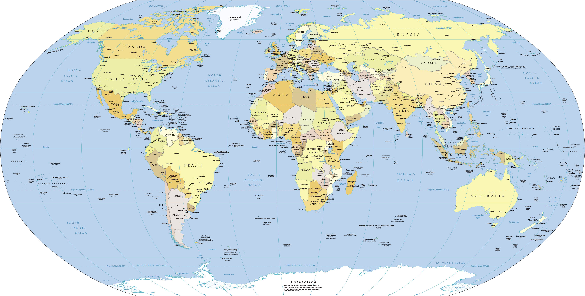
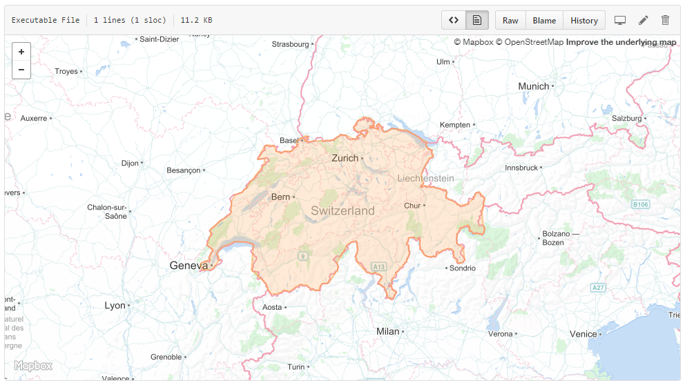

<h1 align="center">
    Countries
</h1>



<p align="center">
    <a href="https://packagist.org/packages/pragmarx/countries"></a>
    <a href="/antonioribeiro/countries/blob/master/LICENSE.md"></a>
    <a href="https://scrutinizer-yaml.com/g/antonioribeiro/countries/?branch=master"></a>
    <a href="https://scrutinizer-yaml.com/g/antonioribeiro/countries/?branch=master"></a>
</p>
<p align="center">
    <a href="https://scrutinizer-yaml.com/g/antonioribeiro/countries/?branch=master"></a>
    <a href="https://travis-ci.org/antonioribeiro/countries"></a>
    <a href="https://packagist.org/packages/pragmarx/countries"></a>
    <a href="https://styleci.io/repos/74829244"></a>
</p>

### What does it gives you?

This package has all sorts of information about countries:

| info            | items |
------------------|-------:|
| taxes           | 32    |
| geometry maps   | 248   |
| topology maps   | 248   |
| currencies      | 256   |
| countries       | 266   |
| timezones       | 423   |
| borders         | 649   |
| flags           | 1,570  |
| states          | 4,526  |
| cities          | 7,376  |
| timezones times | 81,153 |

### Geology and topology maps

Amongst many other information you'll be able to plot country maps:



## Requirements

- PHP 7.0+

## Installing

Use Composer to install it:

```
composer require pragmarx/countries
```

## Instantiating

```php
use PragmaRX\Countries\Package\Countries;

echo $countries->where('cca2', 'IT')->first()->hydrateCurrencies()->currencies->EUR->coins->frequent->first();

// or calling it statically

echo $countries->where('cca2', 'IT')->first()->hydrateCurrencies()->currencies->EUR->coins->frequent->first();
```

Should both return 

```
€1
```

Overloading the default configuration:

```php
use PragmaRX\Countries\Package\Services\Config;

$countries = new Countries(new Config([
    'hydrate' => [
        'elements' => [
            'currencies' => true,
            'flag' => true,
            'timezones' => true,
        ],
    ],
]));
```

#

## Usage

This package is not tied to Laravel and doesn't require it to be installed (we have a [bridge](https://github.com/antonioribeiro/countries-laravel) for this purpose), but it has [Laravel Collections](https://laravel.com/docs/5.6/collections) in its core, all methods in Collections are available, this way you can do things like filter, map, reduce, search, sort, reject, and a lot more. It, actually, uses [Coollection](https://github.com/antonioribeiro/coollection), which is Laravel Collections with a fluent syntax, allowing us to have access to array keys (and values) as object properties.

To get all countries in the data base you just have to:

```php
use PragmaRX\Countries\Package\Countries;

$countries = new Countries();

$all = $countries->all();
```

To get a json you:

```php
return $countries->toJson();
```

Filter by keys and values:

```php
$countries->where('name.common', 'Brazil')
```

Will find Brazil by its common name, which is a

```
#items: array:22 [▼
  "name" => array:3 [▼
    "common" => "Brazil"
    "official" => "Federative Republic of Brazil"
    "native" => array:1 [▼
      "por" => array:2 [▼
        "official" => "República Federativa do Brasil"
        "common" => "Brasil"
      ]
    ]
  ]
```

Or alternatively you can filter like this

```php
$countries->whereNameCommon('Brazil')
```

And, you can go deepeer

```php
$countries->where('name.native.por.common', 'Brasil')
```

Or search by the country top level domain

```php
$countries->where('tld.0', '.ch')
```

To get

```
"name" => array:3 [▼
  "common" => "Switzerland"
  "official" => "Swiss Confederation"
  "native" => array:4 [▶]
]
"tld" => array:1 [▼
  0 => ".ch"
]
```
And use things like pluck

```php
$countries->where('cca3', 'USA')->first()->hydrateStates()->states->pluck('name', 'postal')
```

To get

```php
"MA" => "Massachusetts"
"MN" => "Minnesota"
"MT" => "Montana"
"ND" => "North Dakota"
...
```

The package uses a modified Collection which allows you to access properties and methods as objects:

```php
$countries->where('cca3', 'FRA')
         ->first()
         ->borders
         ->first()
         ->name
         ->official
```

Should give

```
Principality of Andorra
```

Borders hydration is disabled by default, but you can have your borders hydrated easily by calling the hydrate method:

```php
$countries->where('name.common', 'United Kingdom')
         ->hydrate('borders')
         ->first()
         ->borders
         ->reverse()
         ->first()
         ->name
         ->common
```

Should return

```
Ireland
````

### Hydration

To improve performance, hydration, which is enabled by default, can be disable on most country properties, and this is how you manually hydrate properties:

```php
$countries->where('name.common', 'United States')->first()->hydrate('timezones')->timezones->first()->zone_name,

$countries->where('name.common', 'United States')->first()->hydrate('timezones')->timezones->first()->zone_name,
```

Those are some of the hydratable properties:

- Borders
- Cities
- Currencies
- Flag
- Geometry
- Languages
- States
- Taxes
- Timezone
- Topology

### Extra where rules
Some properties are stored differently and we therefore need special rules for accessing them, these properties are
- `ISO639_3` => The 3 letter language code.
- `ISO4217`  => The 3 letter currency code.

You can of course access them like other properties
```php
$countries->whereISO639_3('por')->count()
$countries->where('ISO639_3', 'por')->count()
```

### Mapping
Sometimes you would like to access a property by a different name, this can be done in settings, this way
```php
'maps' => [
    'lca3' => 'ISO639_3'
]
```
Here we bind the language 3 letter short code ISO format to `lca3`, which is short for `language code alpha 3-letter`.
So now we can access the property by
```php
$countries->whereLca3('por')
```
Or
```php
$countries->where('lca3', 'por')
```

## Some other examples from **Laravel News** and some other contributors

#### Generate a list of countries

```php
$countries->all()->pluck('name.common');
```

returns

```php
[
    "Aruba",
    "Afghanistan",
    "Angola",
    "Anguilla",
    "Åland Islands",
    ....
```

#### Generate a list of currencies

```php
$countries->all()->pluck('currencies');
```

returns

```php
$countries->all()->pluck('currencies')
```

#### Get the currency symbol

```php
$countries->where('name.common', 'Brazil')->first()->hydrate('currency')->currencies->BRL->units->major->symbol
```

#### Generate a list of States

```php
$countries->where('name.common', 'United States')
    ->first()
    ->hydrateStates()
    ->states
    ->sortBy('name')
    ->pluck('name', 'postal')
```

returns

```php
[
    "AL": "Alabama",
    "AK": "Alaska",
    "AZ": "Arizona",
    "AR": "Arkansas",
    "CA": "California",
    ....
    ....
```

#### Hydrate and get a cities

```php
$countries->where('cca3', 'FRA')
    ->first()
    ->hydrate('cities')
    ->cities
    ->paris
    ->timezone
```

Should return

```text
Europe/Paris
```

#### Get a countries currency

```php
$countries->where('name.common', 'United States')->first()->currency;
```

returns

```php
[{
    "alternativeSigns": [],
    "ISO4217Code": "USD",
    "ISO4217Number": "840",
    "sign": "$",
    "subunits": 100,
    "title": "U.S. dollar",
    ....
```

#### Get all currencies

```php
$countries->currencies()
```

returns

```php
[
    0 => "AED"
    1 => "AFN"
    2 => "ALL"
    3 => "AMD"
    4 => "ANG"
    5 => "AOA"
    6 => "ARS"
    7 => "AUD"
    8 => "AWG"
    9 => "AZN"
    10 => "BAM"
    ....
```

#### Get the timezone for a State

```php
return $countries->where('name.common', 'United States')->first()->timezone->NC;
```

returns

```php
America/New_York
```

#### Get all timezones for a country

```php
$countries->where('name.common', 'Brazil')
  ->first()
  ->hydrateTimezones()
  ->timezones
  ->map(function ($timezone) {
      return $timezone->zone_name;
  })->values()
  ->unique()
  ->toArray()
```

#### Get all times for a timezone

```php
return $countries->where('name.common', 'United States Virgin Islands')->first()->hydrate('timezones_times')->timezones->first()->times;
```

returns

```php
"times" => [
    "abbreviation" => "LMT"
    "dst" => "0"
    "gmt_offset" => "-14764"
    "time_start" => "-1825098837"
    "zone_id" => "415"
    1 => [
        "abbreviation" => "AST"
        "dst" => "0"
        "gmt_offset" => "-14400"
        "time_start" => "-1825098836"
        "zone_id" => "415"
    ]
]
```

## Flags

Countries provides many different flag sources, including SVG flags. This is how you use one of the available sources:

### Install [flag-icon](https://github.com/lipis/flag-icon-css)

```
npm install --save-dev flag-icon-css
```

### Import it to your project

```
@import '~flag-icon-css/sass/flag-icon.scss';
```

### Use Countries to get the flag span

```
$unitedStatesFlag = 
    $this->countries->where('cca3', 'USA')
    ->first()
    ->flag
    ->flag_icon;
```

### Render it in your blade template

```
{!! $unitedStatesFlag !!}
```

## Publishing assets

You can publish configuration by doing:
```
php artisan vendor:publish --provider=PragmaRX\\Countries\\ServiceProvider
```

## Data

This package uses some other open source packages and, until we don't build a better documentation, you can find some more info about data on [mledoze/countries](https://github.com/mledoze/countries/blob/master/README.md) and how to use it on this fantastic [Laravel News article](https://laravel-news.com/countries-and-currencies).

## Cache

Since this data is not supposed to change, calls are automatically cached.
If you want to change this behaviour, you can edit `config/countries.php` file once it's published.

## Framework bridges

- [Laravel](https://github.com/antonioribeiro/countries-laravel)

## Sample files

- [sample-partial.json](src/data/sample-partial.json): example of a country with no borders hydrated.
- [sample-full.json](src/data/sample-full.json): example of a fully hydrated country.

## Author

[Antonio Carlos Ribeiro](http://twitter.com/iantonioribeiro)
[All contributors](https://github.com/antonioribeiro/countries-laravel/graphs/contributors)

## Copyrights

To build the countries database and relations, this package make use of those sources and packages:

- [mledoze/countries](https://github.com/mledoze/countries)
- [Natural Earth Vector](https://github.com/nvkelso/natural-earth-vector)
- [rinvex/country](https://github.com/rinvex/country)
- [commerceguys/tax](https://github.com/commerceguys/tax)
- [timezonedb](https://timezonedb.com/)
- [wiredmax/world-currencies](https://github.com/wiredmax/world-currencies)

## License

Countries is licensed under the BSD 3-Clause License - see the `LICENSE` file for details

## Contributing

Pull requests and issues are more than welcome.
